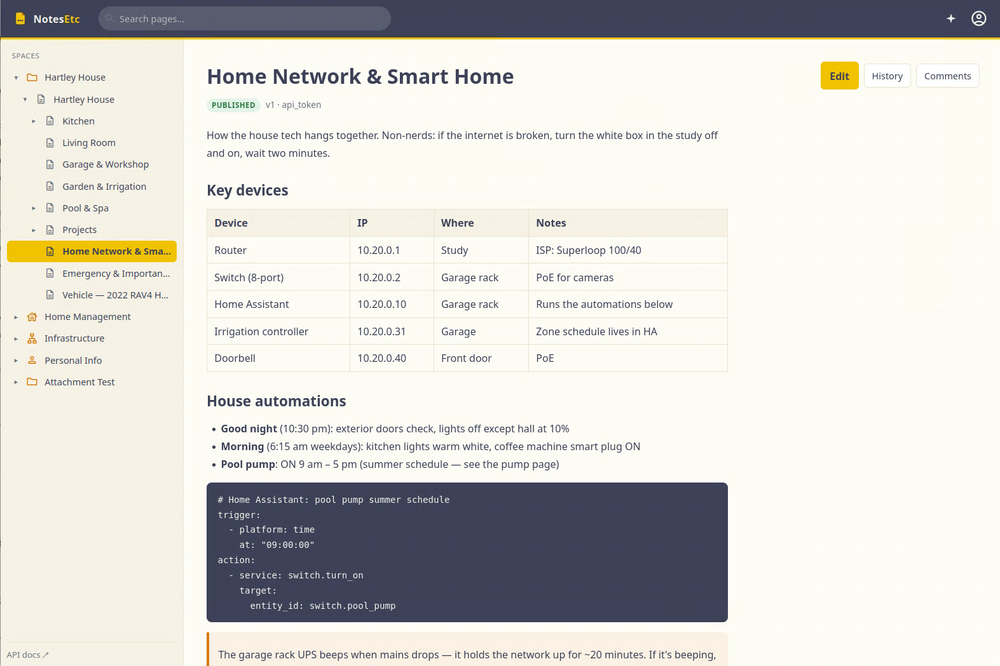
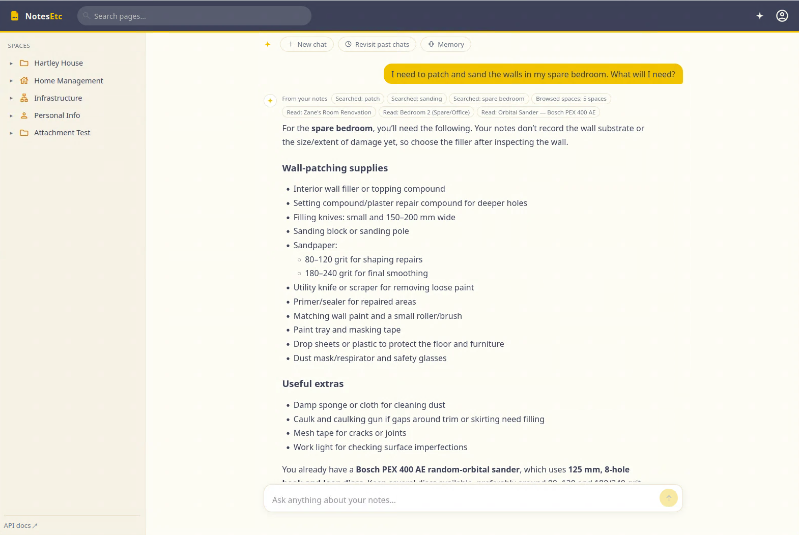
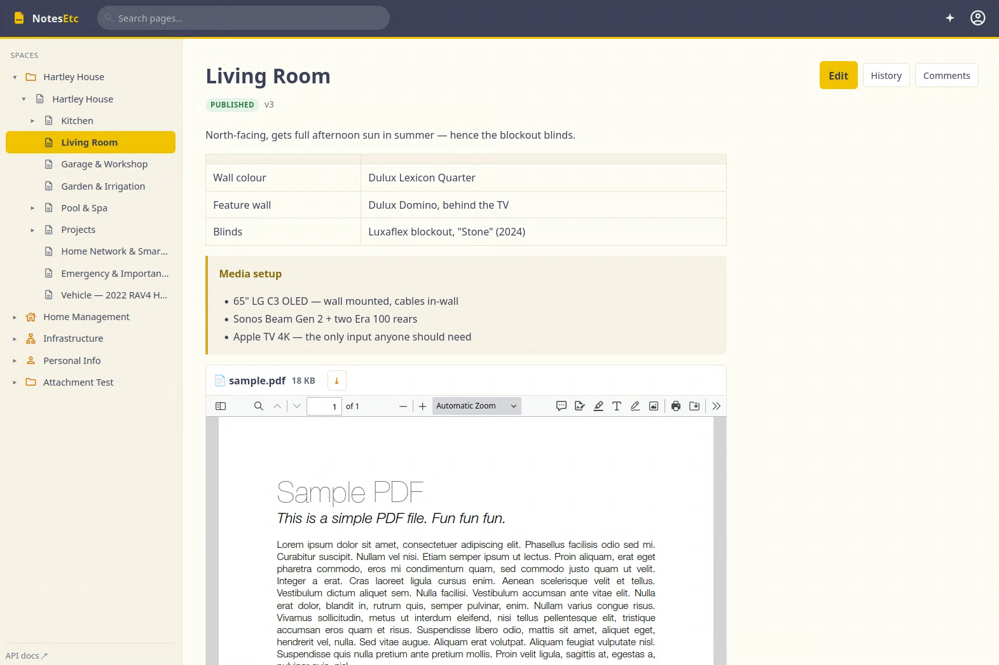
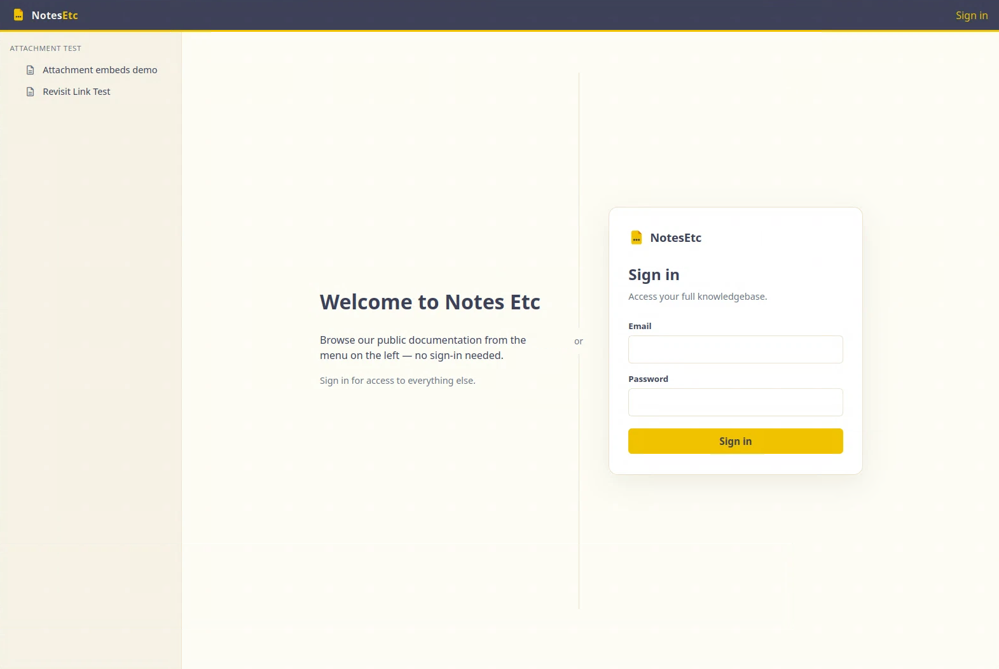

# Notes Etc

**A self-hosted knowledgebase for the things you actually need to remember — built to be read by you *and* your AI.**

Notes Etc is where the important-but-scattered stuff of a household, homelab, or small team lives: which paint is on which wall, what the pool pump manual says about that noise, where the water main shuts off, how the network hangs together. Pages are plain Markdown, organised into permissioned spaces, with every document — manuals, receipts, warranties — attached right where it belongs.

What makes it different: **AI is a first-class citizen, not a bolt-on.** Every surface — the web app, the REST API, the MCP server, the built-in assistant — goes through one service layer with the same permissions, versioning, and audit trail. So when the assistant answers *"what does the dishwasher manual say about error E24?"* or files a scanned receipt onto the right page, it's operating inside the same guarded walls as everyone else, and every change it makes is attributed to it.

## Screenshots

*A page: structured Markdown with tables, callouts, code blocks and a live space tree.*



*The AI assistant answers from your notes and shows exactly which pages it read; documents embed with an inline viewer.*

| | |
| --- | --- |
|  |  |

<p align="center">
  
</p>

## Features

**Organise**
- Spaces with role-based access (viewer / editor / admin), for users, groups, or public
- Nested pages with drafts, publishing, append-only version history, and suggested-edit review
- Full-text search, comments, page templates, and review-due maintenance tracking
- Markdown storage (NEFM) with callouts, coloured sections, and live subpage indexes — the editor is a view, the Markdown is the truth

**Documents**
- Attach PDF, Word, Excel, text, CSV, and images — validated by file bytes, not extensions
- Embed in pages as a link chip, an icon, or a full inline reader
- In-browser viewing for every format, plus server-side text extraction so the AI can read manuals
- Files stored on disk per workspace — mount it wherever you like (local volume, NAS)

**Automate**
- JavaScript automations in a sandboxed worker: page events, cron schedules, or webhooks
- A friendly `netc.*` scripting API for pages, spaces, fetch, and logging
- Encrypted variables for secrets, mock-mode dry runs, live run logs

**AI assistant** (optional — bring your own model)
- Anthropic, OpenAI, Google Gemini, or local Ollama; models auto-listed and capability-tested from the admin panel
- Chat grounded in your notes: it searches, reads pages and attached documents, and shows its sources
- Full tool access with guardrails — it can create and edit pages and automations, attributed and versioned as AI
- Files uploaded documents onto the right page, with a token-cost estimate before content is sent
- Per-user long-term memory (visible and deletable), persistent chat history, optional provider-native web search
- Pages created in a chat link back to the conversation that made them

**Control**
- Every action audited — human, API token, automation, or AI
- API tokens with space scoping, expiry, and one-click rotation
- Secrets encrypted at rest; nothing sensitive in page content or logs

## For your agents

A built-in **MCP server** (`/api/v1/mcp`) exposes the whole surface to agents like Claude: search, read and write pages, list and read attachments (with text extraction), and the full automations lifecycle. The REST API (OpenAPI at `/docs`) offers the same via Bearer tokens. Tokens never exceed their owner's permissions.

## Quick start

```bash
git clone https://github.com/MattLarritt/notesetc.git
cd notesetc
docker compose up
```

Compose pulls the prebuilt image ([`mlarritt/notesetc`](https://hub.docker.com/r/mlarritt/notesetc)) — one container for the API and web app, plus Postgres. Add `--build` to build from source instead.

Then open http://localhost:3100 and sign in with the bootstrap admin (`admin@example.com` / `change-me-please-12+` — change both via `.env`, see `.env.example`). Set `RUN_SEED=true` for a small demo workspace.

The compose stack runs Postgres, the API (NestJS + Prisma), and the web app (Next.js). For production: put real secrets in `.env`, front it with your reverse proxy, and bind the attachment volume to storage you back up. An MSSQL schema variant is generated for enterprise deployments.

## Configuration

| Variable | Purpose |
| --- | --- |
| `DATABASE_URL` | Postgres (or SQL Server) connection string |
| `MASTER_ENCRYPTION_KEY` | 32-byte key for secrets at rest (AES-256-GCM) |
| `SESSION_SECRET` | Signs web session cookies |
| `WEB_ORIGIN` | Public origin of the web app (CORS + cookies) |
| `STORAGE_DIR` | Attachment store root (one folder per workspace) |
| `BREAKGLASS_ADMIN_*` | Bootstrap local admin (remove to disable) |

Everything else — AI provider, models, web search, automations — is configured in the app, in the admin area.
